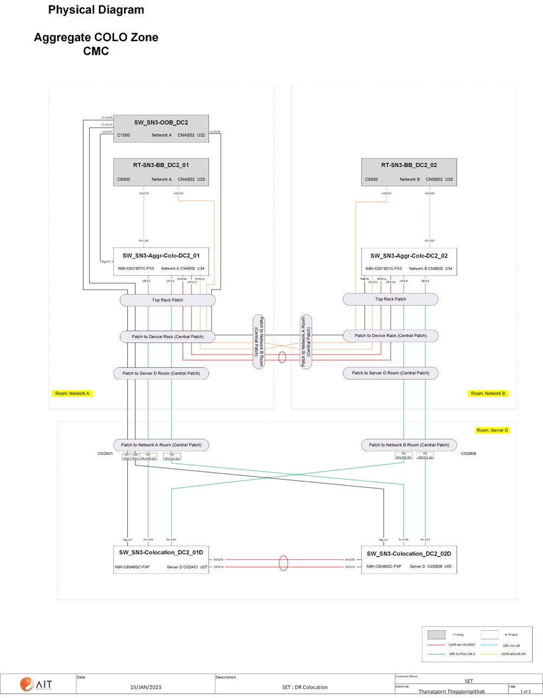
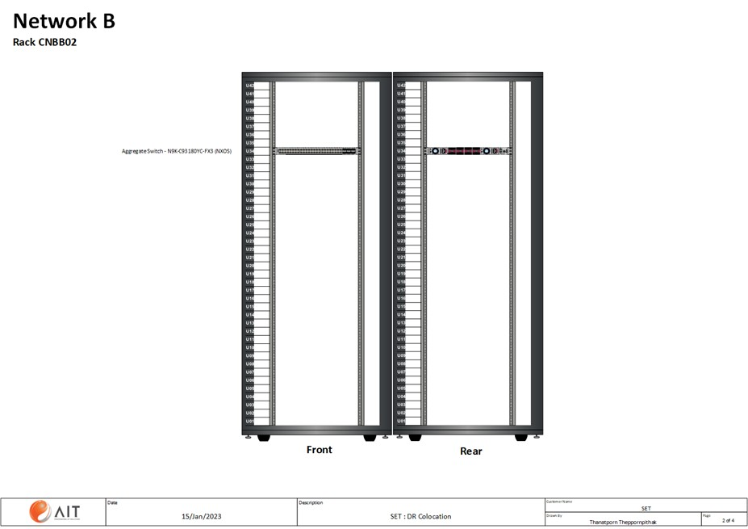

# 📦 Cisco Switch Configuration Backup (SET)

คลังข้อมูลสำรองการตั้งค่าและการตรวจสอบสถานะการทำงาน (Configuration & Operational State Backup) ของอุปกรณ์เครือข่าย Cisco Switch สำหรับสภาพแวดล้อมระบบของตลาดหลักทรัพย์แห่งประเทศไทย (**The Stock Exchange of Thailand - SET**) ประจำศูนย์ข้อมูลทั้ง 2 แห่ง ได้แก่ **DC1 (NDC)** และ **DC2 (CMC / DR Site)**

---

## 📑 สารบัญ (Table of Contents)

- [ภาพรวมโครงการ (Overview)](#-ภาพรวมโครงการ-overview)
- [ผังระบบและไดอะแกรม (Diagrams)](#-ผังระบบและไดอะแกรม-diagrams)
- [โครงสร้างโฟลเดอร์ (Directory Structure)](#-โครงสร้างโฟลเดอร์-directory-structure)
- [รูปแบบการตั้งชื่อไฟล์ (File Naming Convention)](#-รูปแบบการตั้งชื่อไฟล์-file-naming-convention)
- [รายการคำสั่งที่บันทึก (Captured Commands)](#-รายการคำสั่งที่บันทึก-captured-commands)
- [รายการอุปกรณ์เครือข่ายทั้งหมด (Device Inventory)](#-รายการอุปกรณ์เครือข่ายทั้งหมด-device-inventory)
  - [DC1-NDC: Enterprise (14 อุปกรณ์)](#1-dc1-ndc---enterprise-14-อุปกรณ์)
  - [DC1-NDC: Out-Of-Band (OOB) (16 อุปกรณ์)](#2-dc1-ndc---out-of-band-oob-16-อุปกรณ์)
  - [DC2-CMC: Enterprise (7 อุปกรณ์)](#3-dc2-cmc---enterprise-7-อุปกรณ์)
  - [DC2-CMC: Out-Of-Band (OOB) (20 อุปกรณ์)](#4-dc2-cmc---out-of-band-oob-20-อุปกรณ์)
- [แนวทางการค้นหาข้อมูล (Search & Query Examples)](#-แนวทางการค้นหาข้อมูล-search--query-examples)
- [ข้อแนะนำด้านความปลอดภัย (Security Notice)](#-ข้อแนะนำด้านความปลอดภัย-security-notice)

---

## 🎯 ภาพรวมโครงการ (Overview)

Repository นี้ใช้จัดเก็บและติดตามประวัติการสำรองข้อมูลคอนฟิกูเรชัน (Configuration Snapshots) และสถานะการทำงานระดับฮาร์ดแวร์/พอร์ตของสวิตช์เครือข่าย Cisco จำนวนรวมทั้งสิ้น **57 อุปกรณ์** โดยครอบคลุมทั้ง:
- **DC1-NDC (Main Site)**: จำนวน 30 เครื่อง
- **DC2-CMC (Disaster Recovery / Colocation Site)**: จำนวน 27 เครื่อง

ข้อมูลที่สำรองไว้ประกอบด้วยรุ่นฮาร์ดแวร์หลากหลายรุ่น เช่น **Cisco Catalyst 2960X, 2960S, 2960G** และ **Catalyst 4948E**

---

## 🗺️ ผังระบบและไดอะแกรม (Diagrams)

### 1. Physical Topology Diagram (Aggregate COLO Zone CMC)
ภาพรวมโครงสร้างเครือข่ายทางกายภาพ การเชื่อมต่อระหว่าง Core/Backbone Routers (C8500), Aggregate Switches (Nexus 9300), Server Colocation Switches และ OOB Switches



### 2. Rack Layout Diagram (Rack CNBB02 - Network B)
แบบผังการติดตั้งอุปกรณ์สวิตช์ Aggregation บนตู้ Rack CNBB02 ในศูนย์ข้อมูล CMC



---

## 📂 โครงสร้างโฟลเดอร์ (Directory Structure)

```text
backup-config-cisco-set/
├── Backup config/
│   ├── DC1-NDC/
│   │   ├── enterprise/       # สวิตช์โซนองค์กร, Distribution, MDV และ Test Lab (14 เครื่อง)
│   │   └── OOB/              # สวิตช์โซน Out-Of-Band Management และ Server OOB (16 เครื่อง)
│   └── DC2-CMC/
│       ├── Enterprise/       # สวิตช์โซน Enterprise, 3Parties, Voice และ SD-WAN POC (7 เครื่อง)
│       └── OOB/              # สวิตช์โซน OOB, Server OOB, DCIM และ Temp Switches (20 เครื่อง)
├── img/
│   ├── phy.jpg               # Physical Diagram ของ Aggregate COLO Zone CMC
│   └── Rack.jpg              # ผังตู้แร็ค Rack CNBB02
└── README.md                 # เอกสารแนะนำและดัชนีรายชื่ออุปกรณ์
```

---

## 🏷️ รูปแบบการตั้งชื่อไฟล์ (File Naming Convention)

ไฟล์สำรองข้อมูลจัดเก็บในรูปแบบไฟล์ข้อความ (`.txt`) และมีรูปแบบชื่อไฟล์มาตรฐานดังนี้:

```text
<Timestamp>_<Hostname>_<Management-IP>.txt
```

- **`<Timestamp>`**: วันและเวลาที่เริ่มบันทึกข้อมูล รูปแบบ `YYYYMMDD-HHmmssfff` (ปี ค.ศ., เดือน, วัน - ชั่วโมง, นาที, วินาที, มิลลิวินาที) เช่น `20250104-082251615`
- **`<Hostname>`**: ชื่อ Hostname ประจำอุปกรณ์ เช่น `SW-DC1-Distritubute-NSAA02-SET-01`
- **`<Management-IP>`**: หมายเลข IP Address สำหรับบริหารจัดการ เช่น `10.35.1.34`

> *หมายเหตุ: สำหรับอุปกรณ์บางเครื่องที่ยังไม่ได้ตั้งชื่อ Hostname จะใช้รูปแบบ `<Timestamp>_<IP>_<IP>.txt`*

---

## 📋 รายการคำสั่งที่บันทึก (Captured Commands)

ในแต่ละไฟล์สำรองข้อมูล ประกอบด้วยผลลัพธ์จากการรันคำสั่งตรวจสอบสถานะและการทำงานของระบบแบบครบถ้วน ได้แก่:

| ลำดับ | คำสั่ง Cisco IOS | วัตถุประสงค์การตรวจสอบ |
| :---: | :--- | :--- |
| 1 | `terminal length 0` | ปลดล็อกการหยุดหน้าจอเพื่อดึงผลลัพธ์ทั้งหมดอย่างต่อเนื่อง |
| 2 | `show running-config` | ค่าคอนฟิกปัจจุบันทั้งหมด (VLAN, Interface, AAA/TACACS+, Routing ฯลฯ) |
| 3 | `show interface description` | รายละเอียดคำอธิบายหน้าที่ของแต่ละพอร์ต (Port Descriptions) |
| 4 | `show ip int brief` | สรุปสถานะ Interface, IP Address และสถานะ Up/Down |
| 5 | `show interface status` | รายละเอียดความเร็ว, Duplex, VLAN และสถานะพอร์ต |
| 6 | `show vlan` | ฐานข้อมูล VLAN ทั้งหมดที่เปิดใช้งานบนสวิตช์ |
| 7 | `show version` | รุ่นระบบปฏิบัติการ IOS, Uptime, หมายเลข System Serial Number |
| 8 | `show cdp nei` / `show lldp nei` | ตรวจสอบอุปกรณ์ข้างเคียงที่เชื่อมต่อผ่าน CDP และ LLDP |
| 9 | `show ip arp` | ตารางคู่หมายเลข IP และ MAC Address (ARP Table) |
| 10 | `show mac address` | ตารางการจับคู่พอร์ตกับ MAC Address (CAM Table) |
| 11 | `show spanning-tree root` | ตรวจสอบ Root Bridge และต้นไม้ Spanning Tree |
| 12 | `show spanning-tree` | รายละเอียดสถานะ Spanning Tree รายพอร์ต (Blocking, Forwarding) |
| 13 | `show inventory` | รายการชิ้นส่วนฮาร์ดแวร์ Chassis, Power Supply, SFP Module |
| 14 | `show etherchannel summary` | สรุปสถานะการรวมกลุ่มพอร์ต (Port-Channel / LACP) |
| 15 | `show vtp status` | การตั้งค่าและการทำงานของ VLAN Trunking Protocol |

---

## 📊 รายการอุปกรณ์เครือข่ายทั้งหมด (Device Inventory)

### 1. DC1-NDC - Enterprise (14 อุปกรณ์)

| Hostname | รุ่นอุปกรณ์ (Model) | Management IP | ชื่อไฟล์สำรองข้อมูล |
| :--- | :--- | :--- | :--- |
| `SW-DC1-Distritubute-NSAA02-SET-01` | WS-C2960X-24TS-L | `10.35.1.34` | `20250104-082251615_SW-DC1-Distritubute-NSAA02-SET-01_10.35.1.34.txt` |
| `SW-DC1-Distritubute-NSAB11-SET-01` | WS-C2960X-24TS-L | `10.35.1.35` | `20250104-082327799_SW-DC1-Distritubute-NSAB11-SET-01_10.35.1.35.txt` |
| `SW-DC1-MDV-NMAA11-SET-01` | WS-C2960X-24TS-L | `10.35.1.211` | `20250104-082401973_SW-DC1-MDV-NMAA11-SET-01_10.35.1.211.txt` |
| `SW-DC1-MDV-NMAA11-SET-02` | WS-C2960X-24TS-L | `10.35.1.212` | `20250104-082412844_SW-DC1-MDV-NMAA11-SET-02_10.35.1.212.txt` |
| `SW-DC1-MDV-NMBA11-SET-01` | WS-C2960X-24TS-L | `10.35.1.213` | `20250104-082423015_SW-DC1-MDV-NMBA11-SET-01_10.35.1.213.txt` |
| `SW-DC1-MDV-NMBA11-SET-02` | WS-C2960X-24TS-L | `10.35.1.214` | `20250104-082436837_SW-DC1-MDV-NMBA11-SET-02_10.35.1.214.txt` |
| `SW-DC1-TEST-NCAB01-SET-01` | WS-C2960X-24TS-L | `10.35.1.209` | `20250104-082633756_SW-DC1-TEST-NCAB01-SET-01_10.35.1.209.txt` |
| `SW-DC1-TEST-NCAB01-SET-02` | WS-C2960X-24TS-L | `10.35.1.207` | `20250104-082718635_SW-DC1-TEST-NCAB01-SET-02_10.35.1.207.txt` |
| `SW-DC1-TEST-NCAC11-SET-01` | WS-C2960X-24TS-L | `10.35.1.210` | `20250104-082730714_SW-DC1-TEST-NCAC11-SET-01_10.35.1.210.txt` |
| `SW-DC1-TEST-NCAC11-SET-02` | WS-C2960X-24TS-L | `10.35.1.208` | `20250104-082742635_SW-DC1-TEST-NCAC11-SET-02_10.35.1.208.txt` |
| `SW-DC1-TEST-NCBB01-SET-01` | WS-C2960X-24TS-L | `10.35.1.215` | `20250104-082756228_SW-DC1-TEST-NCBB01-SET-01_10.35.1.215.txt` |
| `SW-DC1-TEST-NCBB01-SET-02` | WS-C2960X-24TS-L | `10.35.1.216` | `20250104-082837001_SW-DC1-TEST-NCBB01-SET-02_10.35.1.216.txt` |
| `SW-DC1-TEST-NCBC11-SET-01` | WS-C2960X-24TS-L | `10.35.1.217` | `20250104-082851529_SW-DC1-TEST-NCBC11-SET-01_10.35.1.217.txt` |
| `SW-DC1-TEST-NCBC11-SET-02` | WS-C2960X-24TS-L | `10.35.1.218` | `20250104-082906090_SW-DC1-TEST-NCBC11-SET-02_10.35.1.218.txt` |

---

### 2. DC1-NDC - Out-Of-Band (OOB) (16 อุปกรณ์)

| Hostname | รุ่นอุปกรณ์ (Model) | Management IP | ชื่อไฟล์สำรองข้อมูล |
| :--- | :--- | :--- | :--- |
| `SW-DC1-OOB-NSAA02-SET-01` | WS-C2960X-24TS-L | `10.35.1.251` | `20250103-175640051_SW-DC1-OOB-NSAA02-SET-01_10.35.1.251.txt` |
| `SW-DC1-OOB-NSAA03-SET-01` | WS-C2960X-24TS-L | `10.35.1.252` | `20250103-175653243_SW-DC1-OOB-NSAA03-SET-01_10.35.1.252.txt` |
| `SW-DC1-OOB-NSAB10-SET-01` | WS-C2960X-24TS-L | `10.35.1.253` | `20250103-175802891_SW-DC1-OOB-NSAB10-SET-01_10.35.1.253.txt` |
| `SW-DC1-OOB-NSAB11-SET-01` | WS-C2960X-24TS-L | `10.35.1.254` | `20250103-175817664_SW-DC1-OOB-NSAB11-SET-01_10.35.1.254.txt` |
| `SW-DC1-Server-OOB-Colo-SET-01` | WS-C2960X-48TS-L | `10.35.1.230` | `20250103-175834079_SW-DC1-SERVER-OOB-Colo-SET-01_10.35.1.230.txt` |
| `SW-DC1-Server-OOB-NSAA04-SET-01` | WS-C2960X-48TS-L | `10.35.1.234` | `20250103-175848648_SW-DC1-Server-OOB-NSAA04-SET-01_10.35.1.234.txt` |
| `SW-DC1-Server-OOB-NSAA09-SET-01` | WS-C2960X-24TS-L | `10.35.1.239` | `20250103-175906033_SW-DC1-Server-OOB-NSAA09-SET-01_10.35.1.239.txt` |
| `SW-DC1-Server-OOB-NSAA10-SET-01` | WS-C2960X-24TS-L | `10.35.1.240` | `20250103-175921368_SW-DC1-Server-OOB-NSAA10-SET-01_10.35.1.240.txt` |
| `SW-DC1-Server-OOB-NSAA12-SET-01` | WS-C2960X-48TS-L | `10.35.1.242` | `20250103-175934861_SW-DC1-Server-OOB-NSAA12-SET-01_10.35.1.242.txt` |
| `SW-DC1-Server-OOB-NSAB01-SET-01` | WS-C2960X-24TS-L | `10.35.1.243` | `20250103-175950954_SW-DC1-Server-OOB-NSAB01-SET-01_10.35.1.243.txt` |
| `SW-DC1-Server-OOB-NSAB04-SET-01` | WS-C2960X-48TS-L | `10.35.1.246` | `20250103-180008541_SW-DC1-Server-OOB-NSAB04-SET-01_10.35.1.246.txt` |
| `SW-DC1-Server-OOB-NSAB05-SET-01` | WS-C2960X-48TS-L | `10.35.1.247` | `20250103-180022319_SW-DC1-Server-OOB-NSAB05-SET-01_10.35.1.247.txt` |
| `SW-DC1-Server-OOB-NSAB09-SET-01` | WS-C2960X-24TS-L | `10.35.1.250` | `20250103-180037372_SW-DC1-Server-OOB-NSAB09-SET-01_10.35.1.250.txt` |
| `SW-DC1-Server-OOB-NSAB09-SET-02` | WS-C2960X-24TS-L | `10.35.1.245` | `20250103-180116929_SW-DC1-Server-OOB-NSAB09-SET-02_10.35.1.245.txt` |
| `SW-DC1-Server-OOB-NSBB07-SET-01` | WS-C2960X-24TS-L | `10.35.1.249` | `20250103-180258910_SW-DC1-Server-OOB-NSBB07-SET-01_10.35.1.249.txt` |
| `SW-DC1-Server-OOB-NSBB06-SET-01` | WS-C2960X-24TS-L | `10.35.1.248` | `20250103-180343258_SW-DC1-Server-OOB-NSBB06-SET-01_10.35.1.248.txt` |

---

### 3. DC2-CMC - Enterprise (7 อุปกรณ์)

| Hostname | รุ่นอุปกรณ์ (Model) | Management IP | ชื่อไฟล์สำรองข้อมูล |
| :--- | :--- | :--- | :--- |
| `SW-DC2-3Parties-CNAB01-SET-01` | WS-C2960X-24TS-L | `10.19.255.253` | `20250104-081534488_SW-DC2-3Parties-CNAB01-SET-01_10.19.255.253.txt` |
| `SW-DC2-3Parties-CNBB01-SET-01` | WS-C2960X-24TS-L | `10.19.255.254` | `20250104-081613135_SW-DC2-3Parties-CNBB01-SET-01_10.19.255.254.txt` |
| `SW-DC2-Distribute-CNAB03-01` | WS-C2960X-24TS-L | `10.25.1.34` | `20250104-081755027_SW-DC2-Distribute-CNAB03-SET-01_10.25.1.34.txt` |
| `SW-DC2-Distribute-CNBB03-SET-01` | WS-C2960X-24TS-L | `10.25.1.35` | `20250104-081809277_SW-DC2-Distribute-CNBB03-SET-01_10.25.1.35.txt` |
| `SW-DC2-Voice-CNAA05-SET-01` | WS-C2960X-24TS-L | `10.25.1.26` | `20250104-081831690_SW-DC2-Voice-CNAA05-SET-01_10.25.1.26.txt` |
| `SW-DC2-Voice-CNBA05-SET-01` | WS-C2960X-24TS-L | `10.25.1.27` | `20250104-081853396_SW-DC2-Voice-CNBA05-SET-01_10.25.1.27.txt` |
| `SW-TEMP-POC-SD_WAN` | WS-C2960X-24PS-L | `10.11.255.129` | `20250104-082020338_10.11.255.129_10.11.255.129.txt` |

---

### 4. DC2-CMC - Out-Of-Band (OOB) (20 อุปกรณ์)

| Hostname | รุ่นอุปกรณ์ (Model) | Management IP | ชื่อไฟล์สำรองข้อมูล |
| :--- | :--- | :--- | :--- |
| `SW-DC2-OOB-CNAA03-SET-01` | WS-C2960X-48TS-L | `10.25.1.253` | `20250103-174050777_SW-DC2-OOB-CNAA03-SET-01_10.25.1.253.txt` |
| `SW-DC2-OOB-CNAA03-SET-02` | WS-C2960S-24TS-L | `10.25.1.239` | `20250103-174217133_SW-DC2-OOB-CNAA03-SET-02_10.25.1.239.txt` |
| `SW-DC2-OOB-CNBA03-SET-01` | WS-C2960X-48TS-L | `10.25.1.254` | `20250103-174327623_SW-DC2-OOB-CNAB03-SET-01_10.25.1.254.txt` |
| `SW-DC2-Server-OOB-CHAA08-SET-01` | WS-C2960X-24TS-L | `10.25.1.249` | `20250103-174414256_10.25.1.249_10.25.1.249.txt` |
| `SW-DC2-Server-OOB-CHAA08-SET-02` | WS-C2960X-24TS-L | `10.25.1.250` | `20250103-174501137_SW-DC2-Server-OOB-CHAA08-SET-02_10.25.1.250.txt` |
| `SW-DC2-Server-OOB-CHAB01-SET-01` | WS-C2960X-24TS-L | `10.25.1.248` | `20250103-174522364_10.25.1.248_10.25.1.248.txt` |
| `SW-DC2-Server-OOB-CHAB01-SET-02` | WS-C2960X-24TS-L | `10.25.1.251` | `20250103-174618983_SW-DC2-Server-OOB-CHAB01-SET-02_10.25.1.251.txt` |
| `SW-DC2-Server-OOB-CHAC07-SET-01` | WS-C2960X-48TS-L | `10.25.1.247` | `20250103-174652884_10.25.1.247_10.25.1.247.txt` |
| `SW-DC2-Server-OOB-CHAD01-SET-01` | WS-C2960X-48TS-L | `10.25.1.246` | `20250103-174715955_SW-DC2-SERVER-OOB-CHAD01-SET-01_10.25.1.246.txt` |
| `SW-DC2-Server-OOB-CHAD08-SET-01` | WS-C2960S-24TS-L | `10.25.1.243` | `20250103-174733423_SW-DC2-Server-OOB-CHAD08-SET-01_10.25.1.243.txt` |
| `SW-DC2-Server-OOB-CHAF01-SET-01` | WS-C2960X-48TS-L | `10.25.1.244` | `20250103-174751201_SW-DC2-SERVER-OOB-CHAF01-SET-01_10.25.1.244.txt` |
| `SW-DC2-DCIM-CHAD01-SET-01` | WS-C2960X-24PS-L | `10.25.1.240` | `20250103-174845262_10.25.1.240_10.25.1.240.txt` |
| `SW-DCIM-CHAB01-SET-01` | WS-C2960G-24TC-L | `10.25.1.238` | `20250103-175011479_10.25.1.238_10.25.1.238.txt` |
| `SW-DCIM-CHAD01-SET-02` | WS-C4948E | `10.25.1.236` | `20250103-175303334_SW-DCIM-CHAD01-SET-02_10.25.1.236.txt` |
| `SW-DCIM-CHAF01-SET-01` | WS-C4948E | `10.25.1.237` | `20250103-175329546_SW-DCIM-CHAF01-SET-01_10.25.1.237.txt` |
| `SW-DCIM-CNAB02-SET-01` | WS-C2960S-24TS-L | `10.25.1.234` | `20250103-175347447_SW-DCIM-CNAB02-SET-01_10.25.1.234.txt` |
| `SW-DCIM-CNBB02-SET-01` | WS-C2960S-48TS-L | `10.25.1.235` | `20250103-175404218_SW-DCIM-CNBB02-SET-01_10.25.1.235.txt` |
| `SW-DC2-TEMP-CNAA04-SET-01` | WS-C2960X-24PS-L | `10.11.255.15` | `20250103-175500629_SW-DC2-TEMP-CNAA04-SET-01_10.11.255.15.txt` |
| `SW-DC2-TEMP-CNBA04-SET-01` | WS-C2960X-24PS-L | `10.11.255.14` | `20250103-175513965_SW-DC2-TEMP-CNBA04-SET-01_10.11.255.14.txt` |
| `SW-DC2-Server-OOB-CHAF02-SET-01` | WS-C2960S-24TS-L | `10.25.1.245` | `20250104-080431414_10.25.1.245_10.25.1.245.txt` |

---

## 🔍 แนวทางการค้นหาข้อมูล (Search & Query Examples)

ผู้ดูแลระบบสามารถค้นหาข้อมูลที่ต้องการได้อย่างรวดเร็วผ่าน PowerShell หรือ Command-line ทั่วไป:

### 1. ค้นหาพอร์ตที่เชื่อมต่อกับ VLAN ที่ระบุ
```powershell
# ค้นหาว่ามีพอร์ตหรือคอนฟิกใดผูกกับ VLAN 100 บ้าง
Select-String -Path "Backup config\*\*\*.txt" -Pattern "switchport access vlan 100"
```

### 2. ค้นหาตำแหน่งของ MAC Address ในระบบ
```powershell
# ค้นหา MAC Address ที่ต้องการในตาราง mac address
Select-String -Path "Backup config\*\*\*.txt" -Pattern "aabb.ccdd.eeff"
```

### 3. ค้นหาคำอธิบายพอร์ต (Port Description)
```powershell
# ค้นหาพอร์ตที่มีคำว่า 'Uplink' หรือ 'Trunk'
Select-String -Path "Backup config\*\*\*.txt" -Pattern "description.*Uplink"
```

### 4. ตรวจสอบเวอร์ชัน Cisco IOS Software
```powershell
# ค้นหารุ่นเวอร์ชัน IOS ของสวิตช์ทั้งหมด
Select-String -Path "Backup config\*\*\*.txt" -Pattern "Cisco IOS Software.*Version"
```

### 5. คำสั่งค้นหาผ่าน Bash / Linux CLI (grep)
```bash
# ค้นหาหมายเลข IP Address ในการตั้งค่า Interface VLAN
grep -rn "ip address 10\." "Backup config/"
```

---

## ⚠️ ข้อแนะนำด้านความปลอดภัย (Security Notice)

> [!CAUTION]
> ข้อมูลสำรองการตั้งค่าระบบเครือข่ายมีข้อมูลโครงสร้างพื้นฐานระดับสำคัญ เช่น หมายเลข IP Address ภายใน, พาสเวิร์ดที่ผ่านการแฮช (`enable secret`, `username secret`), ค่า TACACS+ Keys และโครงสร้าง VLAN ผู้นำไปใช้งานพึงระมัดระวังในการเผยแพร่ต่อสาธารณะ และปฏิบัติตามนโยบายความมั่นคงปลอดภัยสารสนเทศขององค์กรอย่างเคร่งครัด
